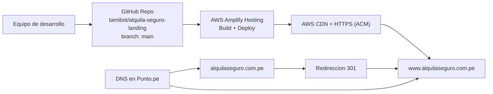
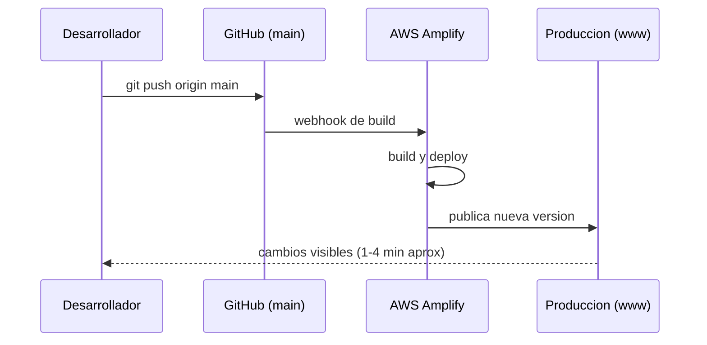
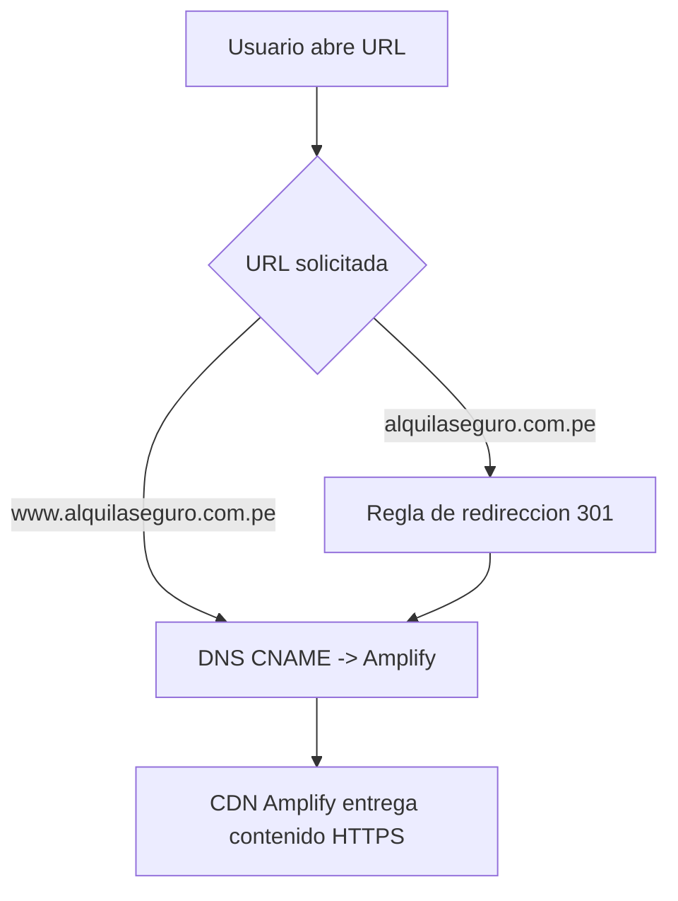

# Infraestructura de Produccion - AlquilaSeguro

## 1. Objetivo de esta documentacion
Este documento describe solo la infraestructura de publicacion:
- Dominio en Punto.pe
- Hosting en AWS Amplify
- Integracion de despliegue automatico con GitHub
- Flujo operativo para cambios en produccion

## 2. Arquitectura actual



## 3. Componentes y responsabilidad

### 3.1 GitHub
- Repositorio fuente: `https://github.com/tamibot/alquila-seguro-landing`
- Rama productiva: `main`
- Trigger de despliegue: cada push a `main`

### 3.2 AWS Amplify
- Servicio de hosting principal
- Lee configuracion de build desde `amplify.yml`
- Publica activos estaticos en CDN
- Gestiona certificado SSL con AWS Certificate Manager (ACM)

### 3.3 Dominio en Punto.pe
- Dominio publico:
  - Canonico: `www.alquilaseguro.com.pe`
  - Apex: `alquilaseguro.com.pe` (redireccionado a `www`)
- Registros esperados:
  - `www` por `CNAME` al target entregado por Amplify
  - Apex por redireccion web 301 a `https://www.alquilaseguro.com.pe`

## 4. Flujo CI/CD de produccion



## 5. Flujo de resolucion DNS



## 6. Runbook de publicacion
1. Realizar cambios en repositorio local.
2. Ejecutar:
```bash
git add .
git commit -m "descripcion del cambio"
git push origin main
```
3. Validar en Amplify que el deploy termine en estado `Deployed`.
4. Verificar sitio en:
   - `https://www.alquilaseguro.com.pe`
   - `https://alquilaseguro.com.pe` (debe redirigir a `www`)

## 7. Checklist de validacion de infraestructura
- GitHub conectado al app de Amplify correcto.
- Auto-build activado para branch `main`.
- Certificado SSL activo y sin advertencias.
- `www` resolviendo al destino Amplify.
- Apex redirigiendo 301 a `www`.

## 8. Alcance actual y siguiente fase
- Alcance actual:
  - Landing estatica desplegada en AWS Amplify.
  - Integracion continua desde GitHub.
- Fase siguiente (opcional):
  - Integrar backend para captura de leads (Railway o AWS serverless).
