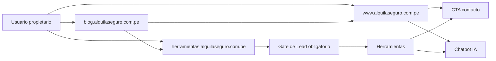
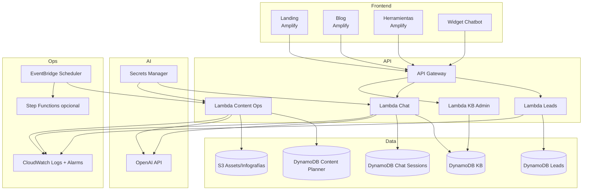
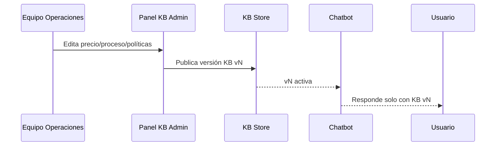
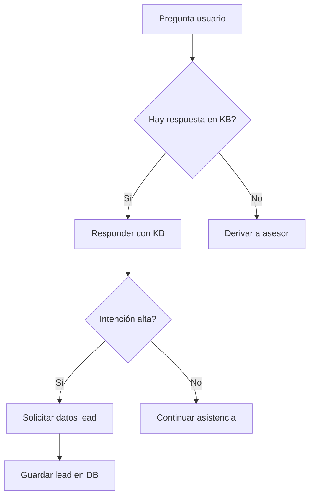
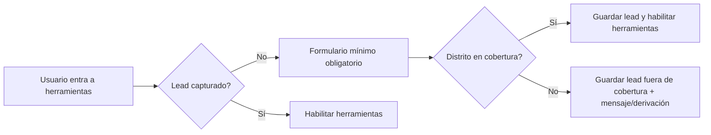
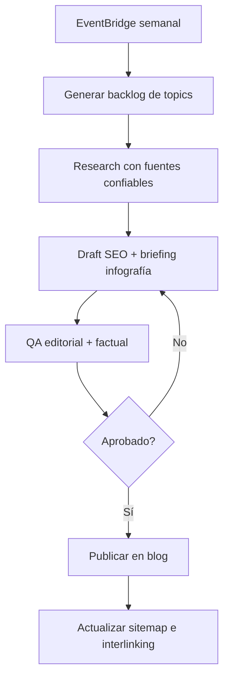
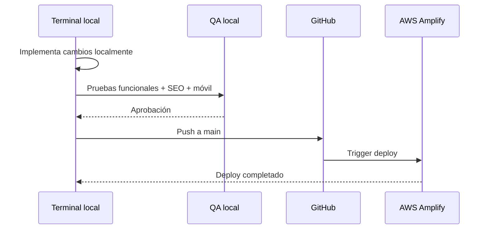

# Roadmap de Producto Integral - AlquilaSeguro

## 0. Propósito de este documento
Este documento define el plan técnico y de producto para construir una plataforma integrada de captación y conversión de propietarios, con enfoque en:
- Landing de alta conversión
- Blog SEO con producción continua de contenido
- Herramientas para propietarios
- Chatbot IA con base de conocimiento dinámica
- Captura y gestión de leads

Objetivo operativo clave:
- Todo se desarrolla y valida primero en terminal/local.
- Nada se despliega a producción sin pasar por validación local y checklist de QA.

---

## 1. Objetivos de negocio y producto

### 1.1 Objetivo principal
Convertir más propietarios calificados en Lima Metropolitana, mostrando una propuesta clara:
- Alquila tu departamento rápido
- Alquila seguro
- Alquila con gestión integral

### 1.2 Objetivos secundarios
- Aumentar tráfico orgánico con blog especializado
- Elevar conversión con herramientas interactivas
- Reducir fricción comercial con chatbot IA
- Estandarizar datos de leads para seguimiento comercial

### 1.3 KPIs iniciales
- Tasa de conversión landing -> lead
- Leads en cobertura vs fuera de cobertura
- Tiempo medio de primera respuesta comercial
- CTR blog -> herramientas
- Uso de herramientas -> lead
- Sesiones asistidas por chatbot -> lead

---

## 2. Modelo de experiencia digital (subdominios)

### 2.1 Reglas de navegación
- Landing sigue siendo el centro comercial
- Blog posiciona y deriva a conversión
- Herramientas generan intención y lead calificado

### 2.2 Regla de captura obligatoria antes de herramientas
Para usar cualquier herramienta, el usuario debe registrar primero:
- Nombre (obligatorio)
- Teléfono (obligatorio)
- Distrito de la propiedad (obligatorio)

Campos opcionales:
- Correo
- Descripción de propiedad

---

## 3. Arquitectura técnica objetivo (AWS)

### 3.1 Hosting
- AWS Amplify para:
  - `www`
  - `blog`
  - `herramientas`

### 3.2 Backend
- API Gateway + Lambdas separadas por dominio funcional
- DynamoDB como base de datos principal en MVP
- S3 para assets dinámicos (si se generan infografías/archivos)

### 3.3 Seguridad
- Secretos en AWS Secrets Manager
- Nunca exponer llaves en frontend
- Rotación de secretos periódica
- CORS restrictivo por subdominio
- Rate limiting en endpoints de chat

---

## 4. Sincronización y single source of truth

### 4.1 Regla de sincronización
- `Base de conocimiento` y `servicios comerciales` deben tener una única fuente activa
- El chatbot no debe responder con datos fuera de esa fuente

### 4.2 Flujo de sincronización de conocimiento

### 4.3 Control de versión de KB
Campos mínimos de versión:
- `kb_version`
- `published_at`
- `published_by`
- `change_summary`
- `is_active`

---

## 5. Base de conocimiento inicial (Proper Rentas)

### 5.1 Bloques principales a incorporar
- Servicios y precios
- Datos y estadísticas
- Proceso y seguridad
- Pagos al propietario
- Tecnología
- Cobertura y limitaciones
- Requisitos para contratar
- Contrato y documentación

### 5.2 Política de uso en interfaz pública
- Landing: mostrar beneficios y cómo funciona (sin sobrecargar precios)
- FAQ: responder fricciones comunes
- Chatbot: sí puede detallar políticas y condiciones cuando el usuario lo solicite

---

## 6. Chatbot IA (landing + herramientas)

### 6.1 Casos de uso
- Resolver preguntas comerciales de forma inmediata
- Guiar al usuario en elegibilidad y cobertura
- Ayudar a completar herramientas
- Capturar lead cuando detecta intención alta

### 6.2 Flujo conversacional con guardrails

### 6.3 Respuestas obligatorias del bot
- Debe indicar límites de cobertura cuando aplique
- Debe evitar promesas fuera de KB
- Debe ofrecer “hablar con asesor” en dudas críticas

### 6.4 Integración de token OpenAI
- El runtime de Lambda leerá el secreto desde Secrets Manager
- Variable de entorno recomendada: `OPENAI_SECRET_ID`
- El valor real de API key se guarda solo en:
  - AWS Secrets Manager (producción)
  - `.env.local` local (no versionado)

---

## 7. Modelo de datos (tablas)

## 7.1 Tabla `leads`
Propósito: registro central de interesados.

Campos sugeridos:
- `lead_id` (PK, UUID)
- `created_at` (ISO)
- `nombre` (required)
- `telefono` (required)
- `correo` (optional)
- `distrito_propiedad` (required)
- `en_cobertura` (boolean)
- `descripcion_propiedad` (optional)
- `origen` (`landing|blog|herramientas|chatbot`)
- `herramienta_origen` (nullable)
- `estado` (`nuevo|contactado|calificado|descartado`)
- `owner_note` (nullable)

Índices sugeridos:
- GSI por `created_at`
- GSI por `estado`
- GSI por `en_cobertura`

## 7.2 Tabla `kb_entries`
Propósito: preguntas/respuestas de operación y servicio.

Campos sugeridos:
- `entry_id` (PK)
- `kb_version`
- `categoria`
- `pregunta`
- `respuesta_corta`
- `respuesta_detallada`
- `tags` (array)
- `activo` (boolean)
- `updated_at`

Índices sugeridos:
- GSI por `kb_version`
- GSI por `categoria`
- GSI por `activo`

## 7.3 Tabla `kb_versions`
Propósito: trazabilidad y publicación.

Campos sugeridos:
- `kb_version` (PK)
- `is_active`
- `published_at`
- `published_by`
- `change_summary`

## 7.4 Tabla `chat_sessions`
Propósito: seguimiento de interacción chatbot.

Campos sugeridos:
- `session_id` (PK)
- `started_at`
- `source` (`landing|herramientas`)
- `lead_id` (nullable)
- `messages_count`
- `resolved` (boolean)

## 7.5 Tabla `chat_messages`
Propósito: auditoría y mejora de respuestas.

Campos sugeridos:
- `message_id` (PK)
- `session_id` (GSI)
- `role` (`user|assistant|system`)
- `content`
- `kb_version_used`
- `created_at`

## 7.6 Tabla `content_calendar`
Propósito: pipeline de blog semanal.

Campos sugeridos:
- `content_id` (PK)
- `status` (`idea|research|draft|qa|ready|published`)
- `target_keyword`
- `search_intent`
- `cluster`
- `assigned_to`
- `due_date`
- `published_url` (nullable)

---

## 8. Gating obligatorio para herramientas (regla de negocio)

Reglas:
- Sin `nombre + teléfono + distrito_propiedad` no se habilita ninguna herramienta.
- Si `distrito_propiedad` no está en cobertura:
  - se guarda lead
  - se marca `en_cobertura=false`
  - se ofrece derivación o lista de espera

---

## 9. Landing: contenido estratégico y FAQ

### 9.1 Estructura recomendada
1. Hero (alquila rápido/seguro)
2. Servicios
3. Cómo funciona
4. Herramientas (beneficios)
5. Resultados/testimonios
6. FAQ
7. Blog
8. Contacto

### 9.2 FAQ sugeridas (base KB)
- ¿Qué incluye Corretaje?
- ¿Qué incluye Administración?
- ¿Cuánto demora alquilar un depa?
- ¿Qué pasa si el inquilino no paga?
- ¿Cuándo recibe el pago el propietario?
- ¿Qué cobertura tienen?
- ¿Trabajan Airbnb o temporal?

### 9.3 Política de precios en landing
- Mantener enfoque consultivo
- Evitar “comparador de precios duro” en home
- Llevar detalle vía FAQ/chatbot/asesoría

---

## 10. SEO + Blog Ops (automatizado y manual)

## 10.1 Objetivo
Publicar entradas semanales para posicionar keywords de alta intención comercial en Lima.

## 10.2 Pipeline semanal automatizado

### 10.3 Flujo manual de entradas
- Crear entrada desde plantilla local
- Completar metadatos SEO obligatorios
- Adjuntar infografía o visual
- Revisar fuentes/citas
- QA móvil + desktop
- Publicar

### 10.4 Requisitos SEO por post
- `title` orientado a keyword
- `meta description` orientada a CTR
- `canonical`
- `og:*` y `twitter:*`
- 1 visual/infografía mínimo
- 2+ enlaces internos
- 1+ fuente externa cuando se usen datos de mercado

### 10.5 Cadencia
- Mínimo: 1 entrada por semana
- Objetivo: 4-6 entradas/mes
- Revisión trimestral de clusters y rendimiento

---

## 11. Flujo local-first y despliegue

Regla de oro:
- Nunca deploy directo sin validar localmente.

---

## 12. Roadmap por fases

### Fase 0 - Cimentación
- Definir estructura final de repos
- Definir tablas y contratos API
- Implementar gate de lead obligatorio

### Fase 1 - Conversión
- FAQ comercial completa
- Captura de leads end-to-end
- Tracking de eventos principales

### Fase 2 - IA asistida
- Chatbot MVP en landing y herramientas
- Integración con KB versionada
- Derivación a asesor + lead enrichment

### Fase 3 - SEO machine
- Pipeline semanal automatizado de contenidos
- Tablero editorial + flujo manual
- Optimización continua de interlinking

### Fase 4 - Escala y calidad
- Observabilidad completa
- Alertas de errores/latencia
- Scorecards de conversión por canal

---

## 13. Sincronización operativa (equipos)
- Operaciones: actualiza KB y políticas
- Comercial: valida messaging y objeciones
- Marketing: define clusters y calendario SEO
- Tecnología: mantiene plataforma y automatizaciones

Reunión de sincronización sugerida:
- Cadencia semanal (30 min)
- Entradas mínimas:
  - cambios en servicio/precio/proceso
  - nuevas FAQs
  - temas SEO de la semana
  - estado de leads y conversiones

---

## 14. Siguientes pasos inmediatos (orden de ejecución)
1. Implementar gate obligatorio de lead en herramientas.
2. Crear API de leads + tabla `leads`.
3. Incorporar FAQ de negocio en landing (alineada a KB).
4. Integrar chatbot MVP con respuestas basadas en KB.
5. Configurar `kb_entries` + `kb_versions`.
6. Activar pipeline semanal de contenido (automático + revisión manual).
7. Definir dashboard de KPIs de conversión y SEO.

---

## 15. Notas de seguridad críticas
- No exponer secretos en frontend, HTML o JS cliente.
- No versionar `.env.local` ni archivos con tokens.
- Usar Secrets Manager en producción para llaves de IA.
- Auditar accesos y rotar credenciales periódicamente.

